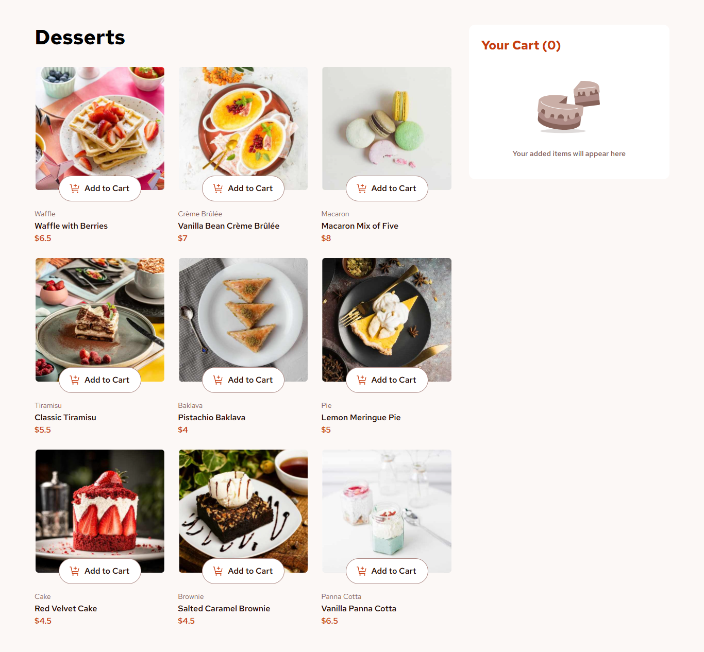

# Frontend Mentor - Product list with cart solution

This is a solution to the [Product list with cart challenge on Frontend Mentor](https://www.frontendmentor.io/challenges/product-list-with-cart-5MmqLVAp_d). Frontend Mentor challenges help you improve your coding skills by building realistic projects.

## Table of contents

- [Overview](#overview)
  - [The challenge](#the-challenge)
  - [Screenshot](#screenshot)
  - [Links](#links)
- [My process](#my-process)
  - [Built with](#built-with)
  - [What I learned](#what-i-learned)
- [Author](#author)

## Overview

### The challenge

Users should be able to:

- Add items to the cart and remove them
- Increase/decrease the number of items in the cart
- See an order confirmation modal when they click "Confirm Order"
- Reset their selections when they click "Start New Order"
- View the optimal layout for the interface depending on their device's screen size
- See hover and focus states for all interactive elements on the page

### Screenshot



### Links

- Solution URL: [Frontend Mentor Solution](https://www.frontendmentor.io/solutions/product-list-with-cart-X6R29yLeNW)
- Live Site URL: [Product List with Cart](https://product-list-with-cart-component.netlify.app/)

## My process

### Built with

- Semantic HTML5 markup
- Tailwind CSS
- Flexbox
- CSS Grid
- Mobile-first workflow
- [React](https://reactjs.org/) - JS library

### What I learned

This project was a deep dive into the fundamentals of React, specifically focusing on **State Management** and **Component Architecture**.

Key takeaways include:

1. **Thinking in React (Component Structure):**

   - Learned to break down the UI into small, reusable components (`DessertCard`, `Cart`, `ConfirmOrderModal`).
   - Understood the importance of "Lifting State Up". Since both the `DessertCard` and `Cart` needed access to the same data, the state had to live in the parent `App` component.

2. **State Management (`useState`):**

   - Used `useState` to track the cart items array and the order confirmation status.
   - Learned how to update state immutably (e.g., using `.map()` to update quantities and `.filter()` to remove items) instead of mutating the array directly.
   - Implemented **Derived State** for the total price and total item count. Instead of creating separate state variables for these, I calculated them on-the-fly using `.reduce()` during render, which prevents state synchronization bugs.

3. **Props & Data Flow:**

   - Practiced passing data (like the `dessert` object) and actions (functions like `addToCart`, `removeFromCart`) down to child components via props.
   - Understood the difference between "Actions" (business logic in parent) and "Handlers" (event listeners in child).

4. **Conditional Rendering:**

   - Used the ternary operator (`? :`) to toggle between the "Add to Cart" button and the quantity controls.
   - Used the logical AND operator (`&&`) to conditionally render the Modal only when the order is confirmed.

5. **Responsive Design with Tailwind:**
   - Implemented a responsive grid layout that shifts from 1 column (Mobile) to 3 columns (Desktop).
   - Used the `<picture>` tag for responsive images to serve different image files based on the screen width, optimizing performance.

```jsx
// Example of Derived State (calculating totals without useState)
const totalItems = cart.reduce((total, item) => total + item.quantity, 0);
```

## Author

- Frontend Mentor - [@gustavo2023](https://www.frontendmentor.io/profile/gustavo2023)
